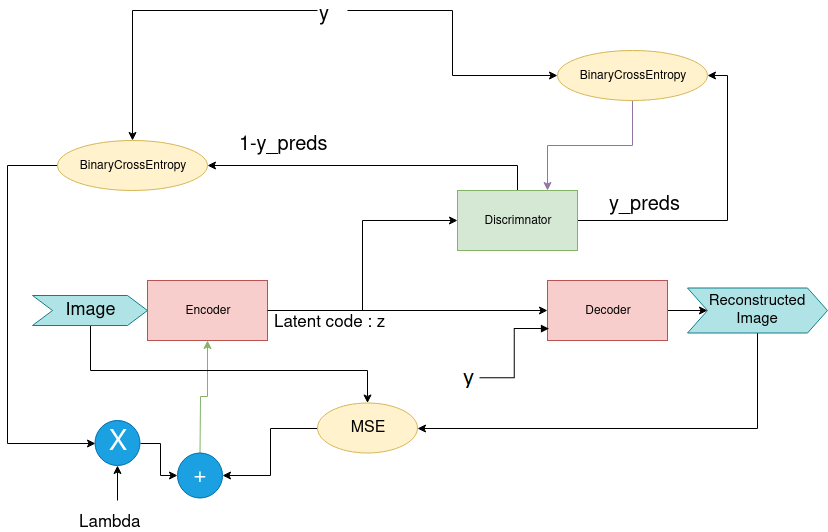
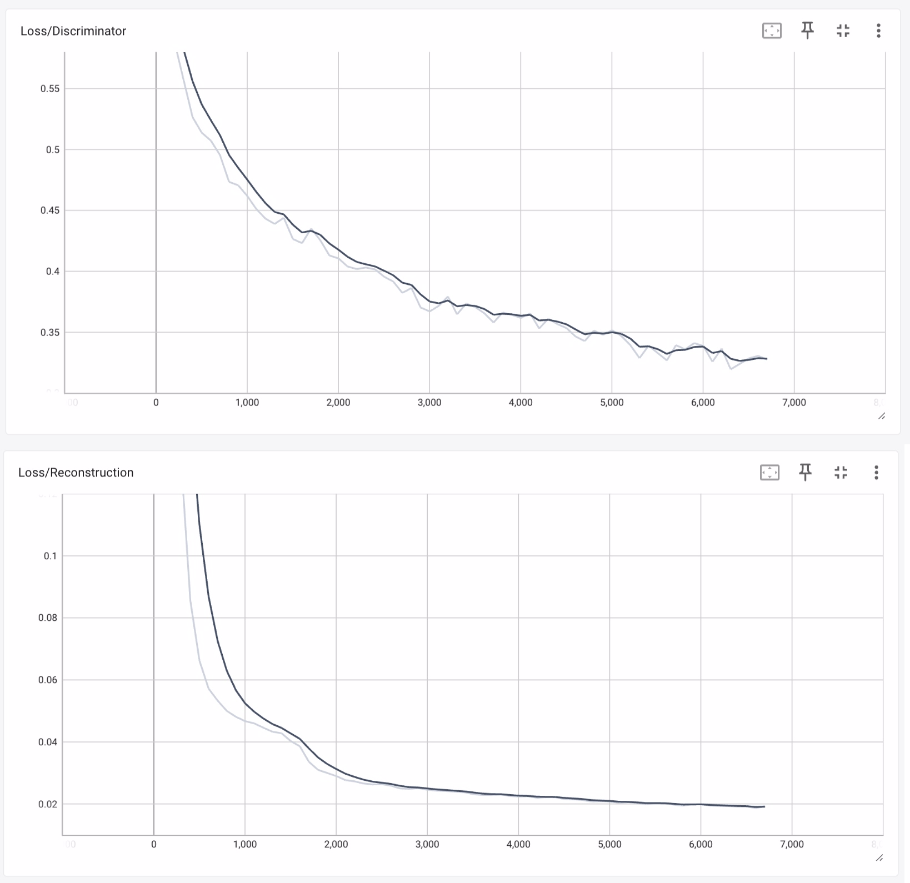
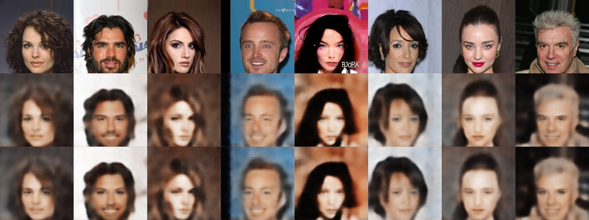
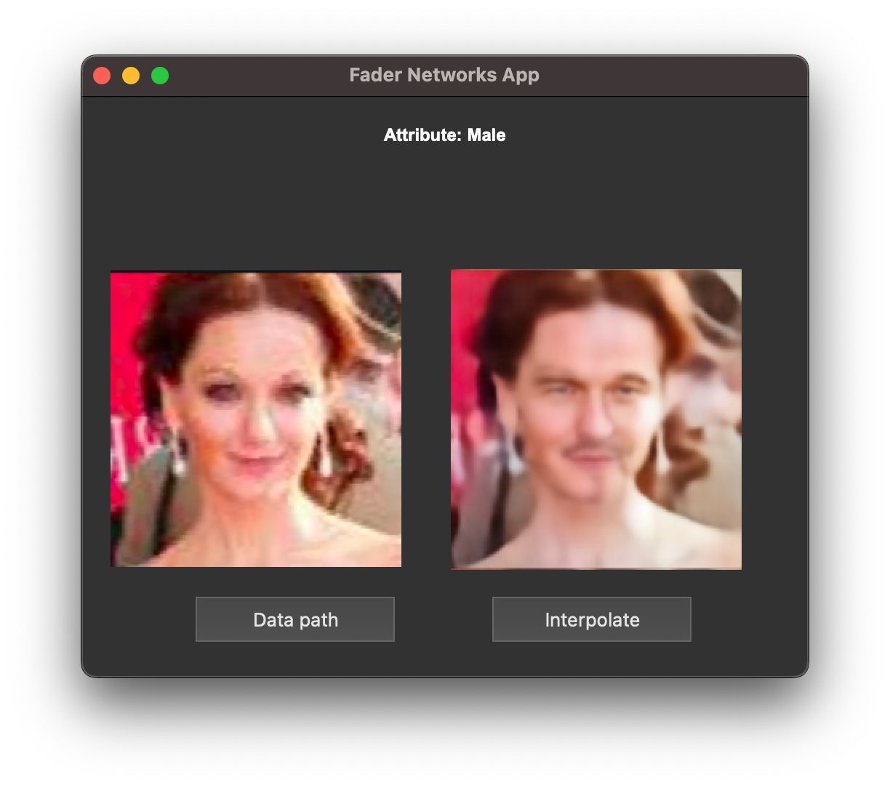

# Fader Networks with Pytorch

This repository presents our machine learning project, which is based on the Fader Networks concept introduced by Lample et al. (2017). Fader Networks utilize an encoder-decoder architecture to modify attributes of real images, such as gender, age, and adding glasses, while preserving the underlying character of the image.

## Introduction

Fader Networks enable the manipulation of natural images by controlling specific attributes, generating various realistic versions of images by altering attributes like gender or age group. These networks can smoothly transition between different attribute values and are built upon an encoder-decoder architecture trained to reconstruct images.


## Dependencies

- Python 3
- [NumPy](http://www.numpy.org/)
- [Pytorch](https://pytorch.org/)
- OpenCV
- CUDA
- PyQt5

## Hardware Requirement
We're running our experiments in colab with following hardware settings : 

GPU : Nvidia T4 (with 23G VRAM) (Only 1.7 Used in this project)
RAM : 12G (2.8G Used )

## Architecture

### Fader Architecture



## Model Results
#### Visualising losses with Tensorboard at 7000 iterations



### Result for Male attribut at 7000 iterations


### Result with the graphical interface for one image


## Data

The dataset used for this project is CelebA, which can be downloaded from [here](https://mmlab.ie.cuhk.edu.hk/projects/CelebA.html).

## Train Fader networks
Specify the name of the trained classifier folder in the params, then train the Fader Network using the following command:
```bash
./train.py # Train Fader Networks model with specified parameters.
--data_path dataset # Specify the dataset directory.
--classifier_path models/classifier.pth # Provide the path to the classifier model.
--attr Gender # Define which attribute to train on, default is 'Gender'.
--batch_size 128 # Set the batch size, default is 128.
--num_epochs 2 # Choose the number of epochs, default is 2.
--learning_rate 0.0002 # Set the learning rate, default is 0.0002.
--lambda_ae 1 # Define the weight for the autoencoder loss, default is 1.
--lambda_dis 0.0001 # Set the weight for the discriminator loss, default is 0.0001.
--train_slice 1000 # Proportion of data for training, default is 1000.
--val_slice 500 # Proportion of data for validation, default is 500.

```

## Inference
Specify the name of the trained Fader Network folder in the params, then run the following command to see the results:
```bash
./interpolation.py # to see results

--data_path dataset # Specify the dataset directory.
--model_path models/best_autoencoder.pt # Path to the trained autoencoder model.
--n_images 2 # Number of images to modify.
--offset 0 # Index of the first image to start modifications.
--n_interpolations 5 # Number of interpolations to perform per image.
--alpha_min 0.0 # Minimum value for interpolation.
--alpha_max 1.0 # Maximum value for interpolation.
--plot_size 5 # Size of each image in the output grid.
--row_wise True # Set to True for horizontal interpolation, False for vertical.
--output_path output.png # Path for saving the output image.

```

## Interface
Specify the path of the immages to do the inference, then run the following command to see the results:
```bash
./inference.py # With PyQt5

```
